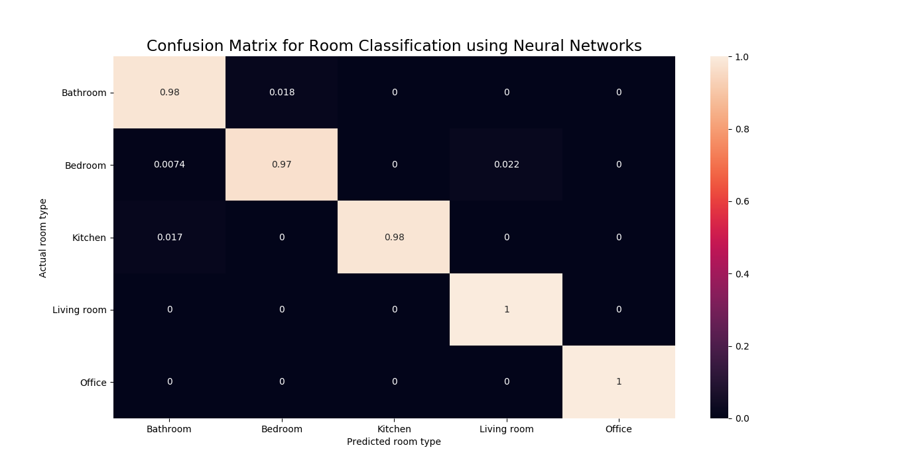

# Feed Forward Neural Network Room classifier for Object detection (Microsoft Image Recognition Challenge for Rooms)
This repository contains a model developed to classify the list of objects (features) such as _toilet_, _table_ to one of five categories (room types): _Bathroom_, _Bedroom_, _Kitchen_, _Living Room_,  _Office_. This is a part of the object detection architecture developed as a group project at ICL. The high-level view of the architecture is presented below:

## [About the project on Microsoft developer blog](https://blogs.msdn.microsoft.com/uk_faculty_connection/2018/06/05/smart-acc-web-application-based-on-faster-rcnn-architecture-making-it-easier-to-find-accommodations-in-london/)

The output from the Convolutional Neural Network contains names of regonised objects and their posistions (in JSON format) on the input image. The JSON response for the training set is then converted to two numpy arrays of size _NxM_ and _Nx1_, where _N_ is the number of training examples and _M_ is a number of objects (features), so the second array is, in effect, a label matrix.

## FFNN model
A simple feed forward neural network was created with two hidden layers created using Microsoft CNTK API. The network was trained using training dataset, validated (using cross validation) and tested on unseen subset of the data. The proportions are: 80:10:10 for training, validation and test accordingly. Test set is subtracted first from the dataset and then K-fold cross validation is used on the remaining part to be able to evaluate the performance of the model and tune the hyper-parameters. After that, the performance on unseen test set is measured. The resulting confusion matrix can be seen below:

### Input:
- features _(Data/object_result.dat)_
- labels _(Data/types_result.dat)_

_**features**_ is a matrix of size  _NxM_ where N is a number of samples and M is the number of features (objects, i.e. _lamp_, _table_) whereas _**labels**_ is a vector of size _Nx1_ and contains _labels_ or numbers representing particular room type.

### Output:
- K classification models to be used in the web application (each model is created for each fold)
- Confusion matrix for K-fold cross valuation

### Dependencies
- matplotlib 1.5.3
- seaborn 0.8.1
- numpy 1.14
- cntk 2.3.0
- easydict 1.6
- Pillow 4.3.0
- utils 0.9.0
- PyYAML 3.12

### Use
1. To allow the program to execute you might be asked to set the environment variable _KMP_DUPLICATE_LIB_OK_ to _TRUE_ by:
 `export KMP_DUPLICATE_LIB_OK=TRUE`
3. Run the script with  `python3 FFNN_classificator.py`
